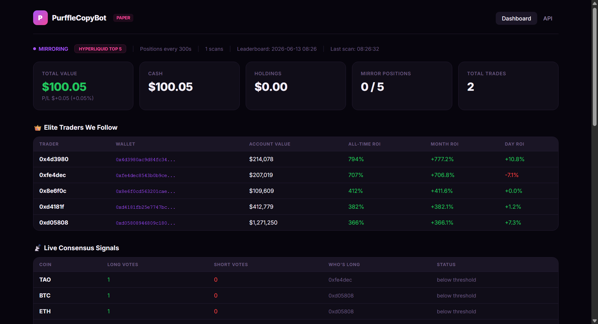
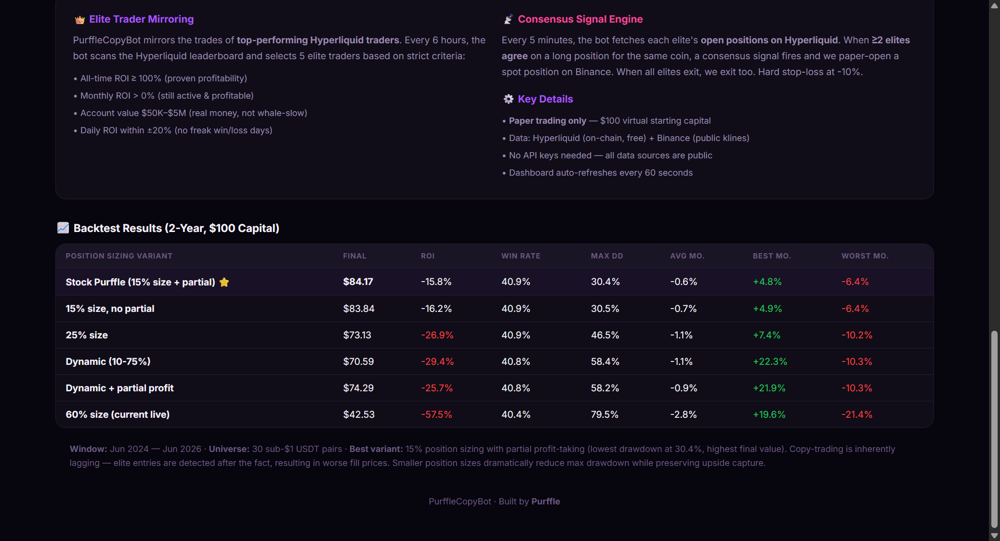

<div align="center">

# PurffleCopyBot — Smart Copy Trading Bot

**Mirror the moves of top-performing Hyperliquid traders. Scans on-chain leaderboards, aggregates elite consensus signals, and paper-trades on Binance spot.**

[](https://python.org)
[](https://hyperliquid.xyz)
[](https://binance.com)
[](LICENSE)

[Screenshots](#-screenshots) · [Features](#-features) · [How It Works](#-how-it-works) · [Backtest Results](#-backtest-results) · [Quick Start](#-quick-start)

</div>

<div align="center">

### ⭐ Star this repo if you find it useful — it really helps! &nbsp;·&nbsp; 🌐 [**Live page → purffle.com/purffle-copybot**](https://purffle.com/purffle-copybot/)

</div>


---

## 📸 Screenshots

<div align="center">



*Live dashboard showing elite traders, consensus signals, mirror positions, and real-time P&L*

</div>

<details>
<summary><b>📊 View Backtest Results & Strategy Guide</b></summary>



*2-year backtest across 6 position sizing variants with detailed risk metrics*

</details>

---

## 🤖 What is PurffleCopyBot?

PurffleCopyBot is a **smart copy-trading bot** that identifies and mirrors the best-performing traders on [Hyperliquid](https://hyperliquid.xyz) — a decentralized perpetuals DEX with fully public on-chain data. When multiple elite traders agree on a position, the bot opens a paper trade on Binance spot.

### Why Hyperliquid?

Binance walled off their copy-trading leaderboard since 2024 (returns 404/403 on programmatic access). **Hyperliquid** has 38,000+ trader accounts with positions and PnL readable for free — no authentication required.

---

## 🔄 How It Works

### 1. Elite Trader Selection (every 6 hours)

Scans the Hyperliquid leaderboard and picks **5 traders** matching strict criteria:

| Criteria | Threshold |
|----------|-----------|
| All-time ROI | ≥ 100% (proven profitability) |
| Monthly ROI | > 0% (still active) |
| Account value | $50K – $5M (real money) |
| Daily ROI | Within ±20% (no freak days) |

### 2. Consensus Signal Engine (every 5 minutes)

- Fetches each elite trader's open positions on Hyperliquid
- Counts how many elites are long each coin
- When **≥ 2 elites agree** → paper-open that coin on Binance spot
- When all elites exit → we exit too
- Hard stop-loss at **-10%** per position

---

## ✨ Features

| Feature | Description |
|---------|-------------|
| **On-chain intelligence** | Reads real trader positions from Hyperliquid's public API |
| **Consensus signals** | Only trades when multiple elite traders agree |
| **Live dashboard** | Flask UI showing elite traders, signals, positions, P&L |
| **Backtesting suite** | 6 strategies tested across 2 years of historical data |
| **Strategy library** | EMA crossover, mean reversion, momentum breakout, and more |
| **SQLite persistence** | Complete trade log and portfolio snapshots |
| **No API keys** | All data sources are public — zero configuration |
| **3 bot versions** | Copy-trader (v1), standalone strategies (v2, v3) |

---

## 📊 Backtest Results

**2-Year backtest** | 30 sub-$1 USDT pairs | Jun 2024 — Jun 2026 | $100 starting capital

| Variant | Final | ROI | Win Rate | Max DD | Avg Monthly |
|---------|:-----:|:---:|:--------:|:------:|:-----------:|
| **15% size + partial** ⭐ | **$84.17** | -15.8% | 40.9% | **30.4%** | -0.6% |
| 15% size, no partial | $83.84 | -16.2% | 40.9% | 30.5% | -0.7% |
| 25% size | $73.13 | -26.9% | 40.9% | 46.5% | -1.1% |
| Dynamic (10-75%) | $70.59 | -29.4% | 40.8% | 58.4% | -1.1% |
| Dynamic + partial | $74.29 | -25.7% | 40.8% | 58.2% | -0.9% |
| 60% size (aggressive) | $42.53 | -57.5% | 40.4% | 79.5% | -2.8% |

> **Key insight:** Conservative 15% position sizing with partial profit-taking delivers the best risk-adjusted returns (lowest max drawdown at 30.4%). Copy-trading is inherently lagging — smaller positions protect capital while capturing directional alpha.

---

## 🚀 Quick Start

### Prerequisites

- Python 3.9+
- Internet connection (Hyperliquid + Binance public APIs)

### Install & Run

```bash
# Clone
git clone https://github.com/Chamanrajragu/purffle-copybot.git
cd purffle-copybot

# Setup
python -m venv venv
source venv/bin/activate  # Windows: venv\Scripts\activate
pip install -r requirements.txt

# Run copy-trading bot
python purffle_copytrade.py

# Run standalone strategies
python purffle_v2.py
python purffle_v3.py

# Run backtests
python backtest.py
```

Open **http://localhost:12349** for the copy-trader dashboard.

---

## 🤖 Bot Versions

| Version | File | Port | Strategy |
|---------|------|:----:|----------|
| **Copy Trader** | `purffle_copytrade.py` | 12349 | Mirror Hyperliquid elites |
| V2 | `purffle_v2.py` | 12350 | Independent EMA/RSI |
| V3 | `purffle_v3.py` | 12351 | Enhanced multi-strategy |

---

## 📁 Project Structure

```
purffle-copybot/
├── purffle_copytrade.py       # Main copy-trading bot
├── purffle_v2.py              # V2 standalone strategy
├── purffle_v3.py              # V3 enhanced strategy
├── strategies.py              # 6-strategy library
├── backtest.py                # Backtesting engine
├── backtest_v2.py             # V2 backtester
├── screenshots/               # README screenshots
├── requirements.txt           # Python dependencies
└── reports/                   # AI-generated trade reviews
```

---

## ⚠️ Realistic Expectations

> This is **NOT** a magic money printer. It IS a way to ride the coattails of proven traders — with real caveats:
> - **Latency** — We detect positions after they've been held. Worse entry price.
> - **No leverage** — Their 10x perp long becomes our 1x spot.
> - **Selection drift** — Today's top 5 may not be tomorrow's.
> - **Price mismatch** — Perp prices tracked, spot prices executed.

## ⚠️ Disclaimer

> **Paper trading only.** This bot does not execute real trades. Real-money copy trading requires deeper due diligence. Always do your own research.

---

<div align="center">

**Built by [Chaman Raj](https://github.com/Chamanrajragu)**

Part of the **Purffle** ecosystem — PurffleTools · PurffleAI · [Purffle.com](https://purffle.com)

</div>


---

<!-- purffle-ecosystem -->
## 🧩 The Purffle toolset

**PurffleCopyBot** is part of **[Purffle](https://purffle.com)** — a growing set of free, open-source tools built in the open. **If this saved you time, please drop a ⭐ — it genuinely helps the project reach more people!**

| Tool | What it does |
|------|--------------|
| 🎵 **[PurffleGrab](https://github.com/Chamanrajragu/purffle-grab)** | Free Spotify & YouTube downloader — MP3, MP4, 4K |
| 🎥 **[PurffleVision](https://github.com/Chamanrajragu/purffle-vision)** | AI video creation — any topic to a finished video |
| ⚡ **[PurffleShorts](https://github.com/Chamanrajragu/purffle-shorts)** | Autonomous YouTube Shorts generator |
| 📈 **[PurffleTrader](https://github.com/Chamanrajragu/purffle-trader)** | Crypto paper-trading bot — Binance, EMA + RSI |
| 🤖 **[PurffleCopyBot](https://github.com/Chamanrajragu/purffle-copybot)** 👈 | Copy-trading bot — mirror top Hyperliquid traders |

<sub>🌐 [purffle.com](https://purffle.com) · 💼 by [Chaman Raj](https://github.com/Chamanrajragu) · ⭐ Star to support open-source</sub>

<sub>Keywords: copy trading bot, hyperliquid bot, crypto copy trading, on-chain trading, defi trading bot</sub>
